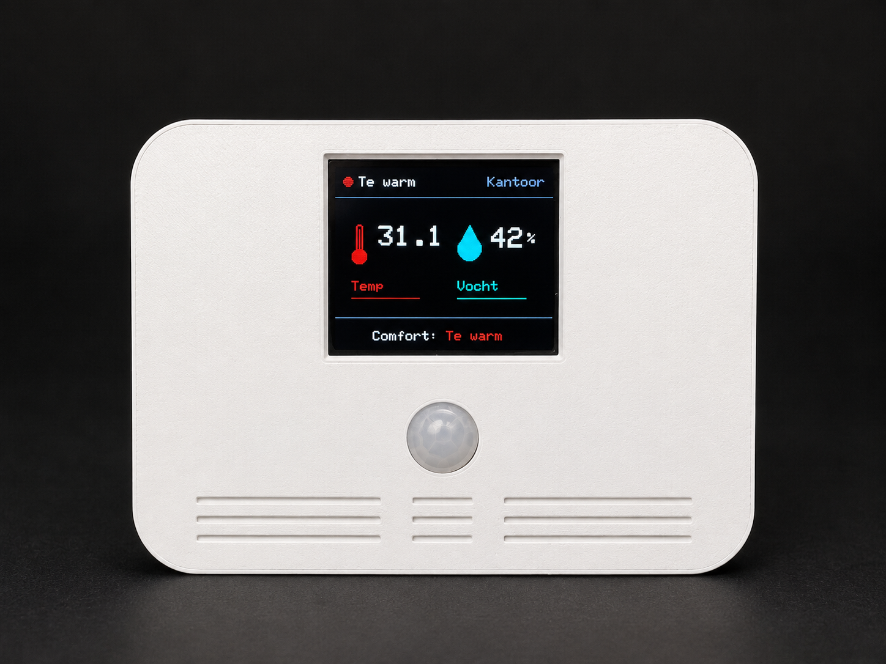

# ESP32 Smart Indoor Thermometer with SHT41 and TFT Display



A compact and modern indoor thermometer project based on an **ESP32**, **SHT41 temperature and humidity sensor**, **1.8 inch ST7735 TFT display**, and a **motion sensor**.

The goal of this project is to create a small stand-alone indoor climate display that looks good in a modern home, but can also be connected to **Home Assistant** using WiFi and MQTT.

This project is part of the **Matteman-Automation** ESP32 and Home Assistant sensor projects.

---

## What does this project do?

This project measures the indoor temperature and relative humidity using a Sensirion SHT41 sensor and shows the values on a small 1.8 inch TFT display.

The display is designed to behave more like a finished product than a simple test screen:

- the display backlight turns on when motion is detected;
- the display stays on while motion or presence is detected;
- after a configurable timeout, the display fades out smoothly;
- the screen layout is updated without fully redrawing the display to reduce flickering;
- a simple comfort status is shown, such as `Comfortable`, `Warm`, `Too warm`, or `Dry air`;
- the project can run completely stand-alone or publish data to Home Assistant using MQTT.

---

## Code versions

This repository contains two versions of the project.

### `Binnenthermometer_1_0`

Stand-alone version.

This version does **not** use WiFi, MQTT or OTA. It is useful when you only want a local indoor thermometer with a display and motion-controlled backlight.

Use this version if:

- you want the simplest possible setup;
- you do not need Home Assistant integration;
- you want the device to work independently;
- you want to use the project as a basic starting point.

### `Binnenthermometer_1_1`

WiFi, MQTT and OTA version.

This version adds network functionality and is intended for integration with Home Assistant.

It includes:

- WiFi connection;
- MQTT publishing;
- OTA updates;
- Home Assistant-friendly JSON payloads;
- non-blocking network handling, so the thermometer keeps working when WiFi or MQTT is temporarily unavailable.

Use this version if:

- you want to show the values in Home Assistant;
- you want to use the data in automations;
- you want to update the ESP32 over the air;
- you want the project to be part of your smart home setup.

---

## Hardware used

The project is built around commonly available ESP32 components.

### Required components

| Component | Purpose |
|---|---|
| ESP32 development board | Main controller |
| SHT41 sensor | Temperature and humidity measurement |
| 1.8 inch ST7735 TFT display | Local display |
| PIR motion sensor or presence sensor | Turns the display on when motion is detected |
| 3D printed enclosure | Housing for the sensor and display |
| Jumper wires | Wiring |
| USB power supply | Power for the ESP32 |

### Optional components

| Component | Purpose |
|---|---|
| Small MOSFET or transistor | Safer display backlight control |
| LD2410C mmWave sensor | Better presence detection than a PIR sensor |
| SCD40 / SCD41 | Future CO2 measurement |
| VEML7700 | Future light measurement and automatic brightness control |

---

## Display behavior

The display is one of the main features of this project.

Instead of keeping the display permanently on, the backlight is controlled by a motion sensor.

When motion is detected:

1. the display backlight fades in smoothly;
2. the temperature and humidity are shown;
3. the comfort status is updated;
4. the display remains active for the configured timeout.

When no motion is detected for the configured timeout:

1. the display backlight fades out smoothly;
2. the ESP32 continues to measure temperature and humidity;
3. in the MQTT version, values can still be published to Home Assistant.

This makes the device more suitable for a bedroom, office or living room because the display is not constantly bright.

---

## Display layout

The display shows a compact dashboard-style interface:

- current comfort status at the top;
- temperature on the left;
- humidity on the right;
- status text at the bottom.

The screen is updated in a way that avoids flickering. The static layout is drawn once, and only the changing values are refreshed.

---

## Comfort status

The comfort status is based mainly on temperature, with humidity as a secondary factor.

Example statuses:

| Condition | Status |
|---|---|
| Very high temperature | Hot |
| High temperature | Too warm |
| Slightly high temperature | Warm |
| Normal temperature and humidity | Comfortable |
| Low temperature | Cool / Cold |
| Low humidity | Dry air |
| High humidity | Too humid |

The thresholds can be adjusted in the code to match your own preference or room type.

---

## Home Assistant and MQTT

The `Binnenthermometer_1_1` version publishes the sensor values as a JSON message over MQTT.

Example MQTT topic:

```text
matteman/binnenthermometer/kantoor/state
```

Example payload:

```json
{
  "temperature": 21.6,
  "humidity": 48,
  "comfort": "Comfortable",
  "display_on": true,
  "wifi_rssi": -61
}
```

In Home Assistant, these values can be read using MQTT sensors with `value_template`.

Example Home Assistant entities:

- indoor temperature;
- indoor humidity;
- comfort status;
- display on/off status;
- WiFi signal strength.

---

## Example Home Assistant MQTT configuration

```yaml
mqtt:
  sensor:
    - name: binnenthermometer kantoor rssi
      unique_id: "binnenthermometer_kantoor_rssi"
      state_topic: "binnenthermometer/kantoor/rssi"
      unit_of_measurement: "dBm"
      icon: mdi:wifi
    
    - name: binnenthermometer kantoor temperatuur
      unique_id: "binnenthermometer_kantoor_temperatuur"
      state_topic: "binnenthermometer/kantoor/temperatuur"
      unit_of_measurement: "°C"
      icon: mdi:thermometer
    
    - name: binnenthermometer_kantoor_vocht
      unique_id: "binnenthermometer_kantoor_vocht"
      state_topic: "binnenthermometer/kantoor/vocht"
      unit_of_measurement: "%"
      icon: mdi:water-percent

---

## Why use an SHT41?

The SHT41 is a reliable temperature and humidity sensor from Sensirion. It is more accurate and stable than many low-cost hobby sensors and is well suited for indoor climate measurements.

For the best measurement results:

- do not place the sensor directly above the ESP32;
- keep the sensor away from heat generated by the display and voltage regulator;
- add ventilation openings near the sensor;
- avoid placing the device in direct sunlight;
- do not mount it directly above a radiator or near a window.

---

## Enclosure design

This project is intended to be used in a 3D printed enclosure.

Design considerations:

- place the SHT41 away from the ESP32 to reduce heat influence;
- add ventilation slots near the sensor;
- keep the display nicely recessed in the front panel;
- make sure the motion sensor has a clear view of the room;
- avoid light leakage around the TFT display;
- use PETG if the device may be placed in a warm room or near sunlight.

---

## Future expansion ideas

This project can be expanded with extra sensors.

Useful future additions:

| Sensor | Function |
|---|---|
| SCD40 / SCD41 | Real CO2 measurement |
| LD2410C | Better presence detection |
| VEML7700 | Light measurement and automatic display brightness |
| SGP40 / ENS160 | VOC / air quality indication |
| PMS5003 / SPS30 | Fine dust measurement |

A future version could become a complete indoor climate monitor for Home Assistant.

---

## Planned video

A video about this project is planned for the Matteman-Automation YouTube channel.

The video will cover:

- why I built this indoor thermometer;
- the hardware used;
- how the SHT41 sensor is connected;
- how the TFT display is controlled;
- how the motion-controlled backlight works;
- the difference between the stand-alone and MQTT versions;
- how to use the values in Home Assistant;
- design choices for the 3D printed enclosure.

When the video is available, the link will be added here.

<!-- Future video link: https://www.youtube.com/@MattemanAutomation -->

---

## Repository structure

Example structure:

```text
.
├── Binnenthermometer_1_0/
│   └── Binnenthermometer_1_0.ino
├── Binnenthermometer_1_1/
│   └── Binnenthermometer_1_1.ino
├── images/
│   └── inside_temp.png
└── README.md
```

If you place `inside_temp.png` in a different folder, update the image path at the top of this README.

---

## Notes

- This project was built and tested with an ESP32 development board.
- The code uses the newer ESP32 Arduino core LEDC functions.
- If the display backlight behaves inverted, adjust the backlight setting in the code.
- If upload issues occur, try lowering the ESP32 upload speed in the Arduino IDE.

---

## About

Created by **Matteman-Automation**.

This project is part of a larger series about building your own ESP32 sensors for Home Assistant.
